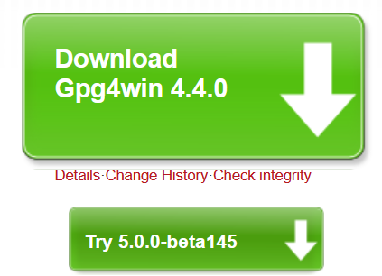
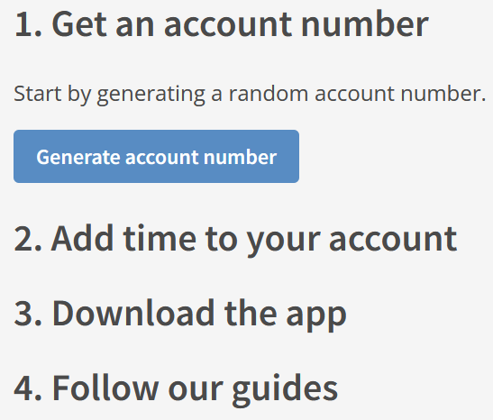
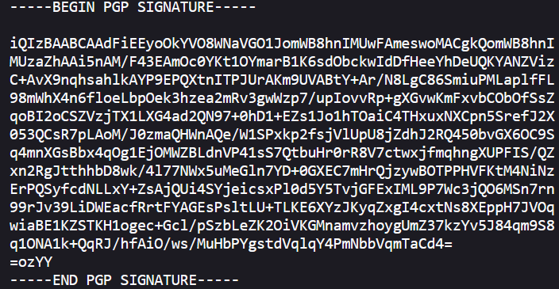
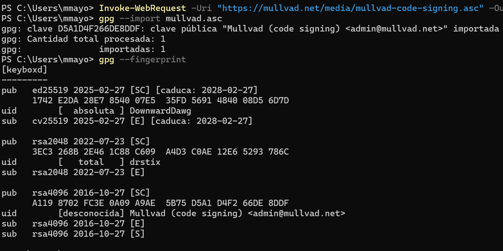
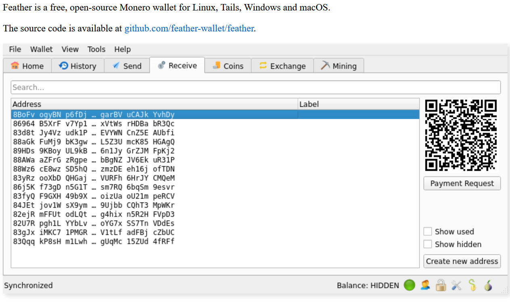
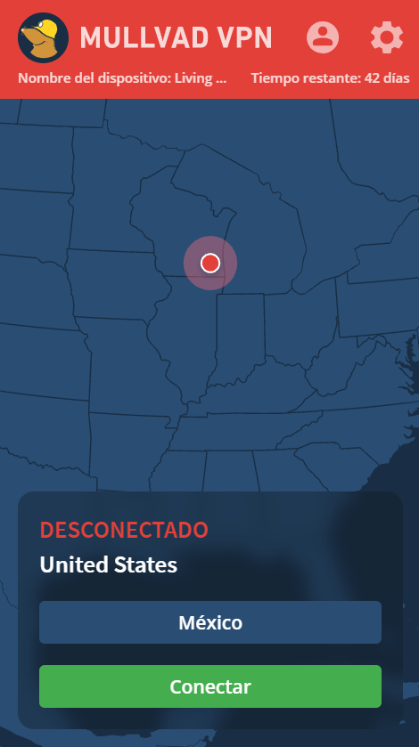
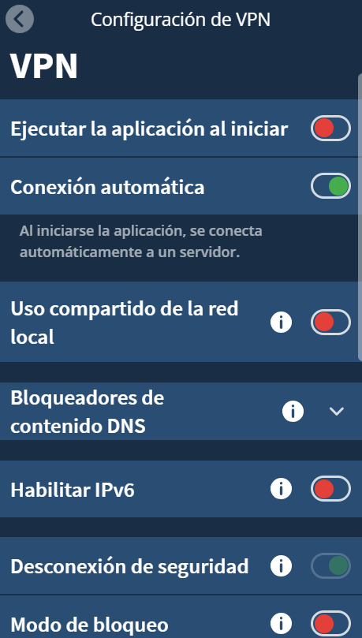
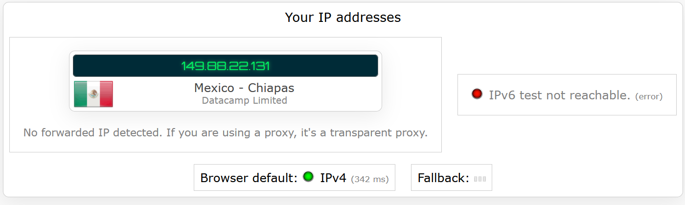
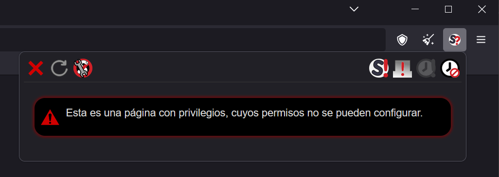

# How to Set Up Mullvad VPN on Windows 11 for Maximum Anonymity and Privacy


##### ***DISCLAIMER: images will be in Spanish because my computer is in Spanish and I'm not changing my language for an assignment***

This guide will walk you through setting up Mullvad VPN on a Windows 11 machine with a very strong emphasis on **maximum anonymity and privacy**. You will verify the VPN software using **PGP signatures**, create an anonymous account, **pay with cryptocurrency**, and configure the app securely.

---

<style>
div.grid {
  display: grid;
  grid-template-columns: 60% 40%;
  gap: 20px;
}
div.left {
  grid-column: 1;
}
div.right {
  grid-column: 2;
}
img {
  width: 100%; /* force image to scale with column */
  height: auto;
  border: 1px solid #ccc;
  border-radius: 4px;
  padding: 4px;
  box-shadow: 0 0 4px rgba(0,0,0,0.1);
}
</style>


<div class="grid">

<div class="left">

## Step 1: Install GPG (Gpg4win)
```powershell
Invoke-WebRequest -Uri "https://files.gpg4win.org/gpg4win-4.2.0.exe" -OutFile "gpg4win.exe"
Start-Process .\gpg4win.exe
```
During install, ensure **Kleopatra** is selected.

</div>
<div class="right">

</div>

<div class="left">

## Step 2: Download Mullvad Installer and Signature
```powershell
Invoke-WebRequest -Uri "https://mullvad.net/en/download/app/exe/latest" -OutFile "MullvadVPN.exe"
Invoke-WebRequest -Uri "https://mullvad.net/en/download/app/exe/latest/signature" -OutFile "MullvadVPN.exe.sig"
```
Use **Tor** or **Brave** browser for better anonymity when downloading.

</div>
<div class="right">

</div>

<div class="left">

## Step 3: Import Mullvad’s Public PGP Key
```powershell
Invoke-WebRequest -Uri "https://mullvad.net/media/mullvad-code-signing.asc" -OutFile "mullvad.asc"
gpg --import mullvad.asc
gpg --fingerprint
```
Verify the fingerprint against Mullvad’s official key.

</div>
<div class="right">

</div>

<div class="left">

## Step 4: Verify the Installer
```powershell
gpg --verify MullvadVPN.exe.sig MullvadVPN.exe
```
Ensure the signature is **valid** and matches Mullvad's key.

</div>
<div class="right">

</div>

<div class="left">

## Step 5: Create an Anonymous Mullvad Account
1. Visit [mullvad.net](https://mullvad.net) using Tor.
2. Click **Generate Account**.
3. Save the **16-digit account number** securely.

</div>
<div class="right">

</div>

<div class="left">

## Step 6: Pay with Cryptocurrency (Monero)
- Buy **Monero (XMR)** anonymously.
- Use **Feather Wallet**: https://featherwallet.org
- Send payment to the address provided by Mullvad.
- Wait for confirmation.

</div>
<div class="right">

</div>

<div class="left">

## Step 7: Install Mullvad VPN
```powershell
Start-Process .\MullvadVPN.exe
```
Follow the prompts to install.

</div>
<div class="right">

</div>

<div class="left">

## Step 8: Configure Mullvad for Privacy
1. Launch Mullvad and enter your account number.
2. Enable:
   - Auto-connect
   - Kill switch
   - Block LAN
   - Multihop: Sweden → Iceland

</div>
<div class="right">

</div>

<div class="left">

## Step 9: Test for IP, DNS, and WebRTC Leaks
- Visit:
  - https://ipleak.net
  - https://browserleaks.com
- Confirm:
  - IP address is hidden
  - DNS is secure
  - WebRTC disabled or masked

</div>
<div class="right">

</div>

<div class="left">

## Step 10: Maintain Privacy Long-Term
- Use LibreWolf or Tor Browser
- Disable JavaScript when possible
- Clear cookies regularly
- Avoid personal logins with anonymous setup

</div>
<div class="right">

</div>

</div>

---

## Conclusion: Anonymity vs. Privacy

- **Privacy** means protecting your data and keeping your activities hidden from outsiders (e.g., ISPs, advertisers).
- **Anonymity** means hiding your **identity** entirely—so actions can't be traced back to you.

Using tools like Mullvad with cryptocurrency and PGP verification maximizes both when used correctly.

Stay safe. Stay private. Stay anonymous.

### ALSO A NOTE FOR PROFESSOR, IT WAS VERY DIFFICULT TO TURN THIS CODE INTO A WORD DOC AND PDF SO IT MAY NOT TURN OUT AS GREAT UNLESS YOU USE A CODE EDITOR TO VIEW THE OUTPUT
